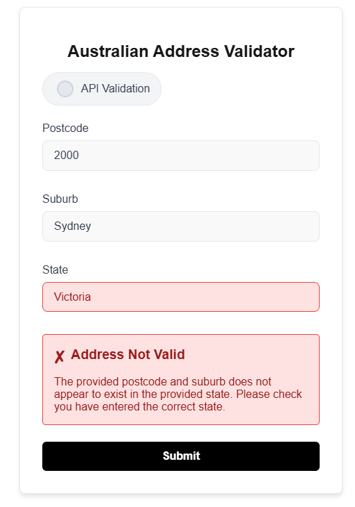

# Australian Address Validator

This project is a Next.js application that validates Australian addresses using APIs. It integrates with the Australia Post API for postcode lookups and OpenAI for additional processing.

## Features

- Validate Australian addresses with postcode and suburb.
- Integrates with Australia Post API for address verification.
- Simple and responsive user interface.
- GraphQL serverless function powered by Apollo Client.
- Custom provider for address validator form state management.
- OpenAI integration with custom tool calling.
- Integration tests for the backend and UI tests for the frontend.

## Live Demo

## This project has been deployed to vercel, and can be accessed here: [Lawpath Tech Test Deployment](https://lawpath-tech-test-isr8.vercel.app)

## Getting Started

### 1. Clone the Repository

```bash
# Clone this repository
git clone https://github.com/SimonHanlyJones/lawpath_tech_test

# Navigate to the project directory
cd lawpath_tech_test
```

### 2. Install Dependencies

```bash
# Install project dependencies using npm
npm install

```

### 3. Set Up Environment Variables

Create a `.env.local` file in the root of your project directory and add the following variables:

```env
AUS_POST_KEY=<your-australia-post-api-key>
AUS_POST_POSTCODE_SEARCH_URL=https://digitalapi.auspost.com.au/postcode/search

OPENAI_KEY=<your-openai-api-key>
```

Replace `<your-australia-post-api-key>` and `<your-openai-api-key>` with your respective API keys.

### 4. Run the Application

```bash
# Start the development server
npm run dev

```

The application will be available at `http://localhost:3000`.

---

## Running Integration Tests

To run integration tests, follow these steps:

1. Start the a production server:

   ```bash
   npm run build
   npm run start
   ```

2. Open a new terminal and run the backend tests:

   ```bash
   npm test
   ```

3. Run the frontend tests:

   ```bash
   npx playwright test
   ```

This will execute the integration tests against the server.

---

## Deployment

### Vercel Deployment

This project is optimized for deployment on Vercel. Follow these steps to deploy your own instance:

1. Push your repository to a version control platform (e.g., GitHub).
2. Connect your repository to [Vercel](https://vercel.com/).
3. Set the environment variables (`AUS_POST_KEY`, `AUS_POST_POSTCODE_SEARCH_URL`, and `OPENAI_KEY`) in the Vercel dashboard under the project settings.
4. Deploy the project via the Vercel dashboard.

---

## API Key Information

### Australia Post API

- [Australia Post API Documentation](https://developers.auspost.com.au/)
- Used for postcode and suburb validation.

### OpenAI API

- [OpenAI API Documentation](https://platform.openai.com/docs/)
- Used for additional address processing (if applicable).

---

## Scripts

| Command         | Description                       |
| --------------- | --------------------------------- |
| `npm run dev`   | Start the development server.     |
| `npm run build` | Build the project for production. |
| `npm start`     | Run the production build.         |

---

## Directory Structure

```plaintext
.
├── app                  # Core application directory
│   ├── components       # Reusable React components
│   ├── fonts            # Custom fonts
│   ├── styles           # CSS
│   ├── interfaces       # TypeScript interfaces
│   └── lib              # Library code
├── contexts             # Context API for state management
├── pages                # Next.js API routes
├── public               # Public assets
└── tests                # Test files
```

## Criteria

This task includes extensive evaluation criteria. Each of these are addressed below:

## Next.js and React Proficiency

### Effective use of Next.js features and React best practices & Clean and maintainable code structure

This is evident throughout the repo. The AddressContext provider used for state management is an example of my React proficiency. Providers are generally useful in state management as they divide concerns and allow for more centralized logic, away from the UI itself.

I also made an effort to create reusable form components for the checkbox, dropdown and input fields. These could be reused if this project is extended. They can be found here: src\app\components\addressValidatorComponents

The validatorProxy serverless endpoint is an example of my proficiency with next.js.

## GraphQL Integration

### Successful implementation of Apollo Client to interact with a GraphQL proxy

This criteria has been achieved. The function responsible for generating the clientside query is located in this file postcodeValidatorFunctions.ts in the src\app\lib\clientside.

On the backend, the responsible function is located here: src\pages\api\validatorProxy.ts

This interaction is supported by typescript interfaces contained here: src\app\interfaces\frontendBackendCommunication. It is my preference to use static types where possible.

### Ability to proxy REST APIs through GraphQL

I have successfully encapsulated the AustPost postcode API through the serverless endpoint through graphQL, the responsible function is here: src\app\lib\serverSide\austpostPostcodeValidator\austpostPostcodeValidatorFunctions.ts

## AI Integration

### Implementation and configuration of OpenAI API endpoints with proper authentication and error handling

OpenAI has been successfully integrated. The relevant file is here: src\app\lib\serverSide\openAiPostcodeValidator\openAiPostcodeValidatorFunctions.ts

### Effective use of function calling to validate address data with structured input/output management

I have set up a custom tool as required, I have also set up capacity for the OpenAi model to make a number of postcode searches in reaching it's validation decision. I arbitrarily limited this to 5 tool calls. This was not needed, as the model generally only makes one enquiry. The functions for this feature are here: src\app\lib\serverSide\openAiPostcodeValidator\openAiPostcodeValidatorFunctions.ts.

## User-Centric Web Forms

### Intuitive and accessible form design & Effective client-side validation and user feedback

I hope that the form design is to your liking. I have added client-side validation, with detail user feedback for all detectable errors. In addition a red color is given to fields that are likely the cause of an invalid postcode. For example, if a postcode matches a suburb, but the state is wrong. I attempt to guide the user to the error is shown in the screenshot below:



## Technical Expertise

### Use of TypeScript for type safety

I use TypeScript extensively in this project, the interfaces are found here, with further organization: src\app\interfaces

### Well-structured HTML5 and CSS

As mentioned above, I made an effort to make reusable react components, simplifying the HTML structure. The CSS has been split up conceptually based on use. The files can be found here: src\app\styles

### Responsive design considerations

I made an effort to consolidate state updates where possible. As this is a stateful project, it was not possible to leverage the server side rendering features of Next.js.

## Git Best Practices

### Regular and descriptive commits

The GitHub repo certainly contains a large number of descriptive commits.

### Proper branching strategy if applicable

During the project I experimented with several testing frameworks, including experimenting with replacing the project dependencies with those from the Jest, next.js demo project. This provided functional to some extend, but too risky. Because of the risk, I used a separate branch which was not merged back to main.

### Clear documentation in the repository

This is the documentation. I hope it is clear.

## Error Handling

### Implement robust error handling for both validation methods & ### Provide user-friendly error messages

Error handling is robust. If an API fails, in addition to an error being thrown, the user interface will indicate a technical failure and prompt the user to try again.

## Code Quality

### Follow consistent coding standards and style guides & Include comments and documentation where necessary

All functions have docstrings and the code is hopefully reasonably clear.
